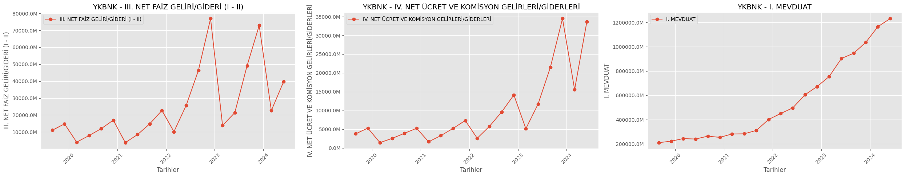

# Banka Analiz Projesi
## Giriş
Bu proje seçilmiş bankaların finansal tablolarında ve bilançolarında yer almış bazı kalemlere ve bu bankaların hisse değerlerindeki değişime odaklanmıştır. Projede Akbank, Halkbank, İş Yatırım, QNB Finansbank ve Yapı Kredi'ye ait veriler kullanılmıştır. İlgili veriler farklı kaynaklardan elde edilmiştir. Bilanço verilerine erişmek için İş Yatırım, finansal tablo verilerine erişmek için Halk Yatırım ve ilgili hisse senedi verileri için isyatirimhisse kütüphanesi kullanılmıştır. Proje python kullanılarak yapılmıştır. Matplotlib, Pandas ve verileri ilgili sitelerden çekilebilmesi için BeautifulSoup kütüphanelerinden yararlanılmıştır.

Bankaların bilanço ve finansal tablolarında birçok farklı kalem yer almaktadır. Analizin karmaşıklığını artırmamak amacıyla bankanın ekonomik durumunu önemli şekilde etkileyen kalemler hesaba katılmıştır. Bu yüzden finansal tablodan "Net Kar" ile "Sermaye Yeterlilik Oranı" sütunları dikkate alınmıştır. Bilançolardan ise "Net Faiz Geliri/Gideri","Net Ücret ve Komisyon Gelirleri/Giderleri","Mevduat","Kredilerden Alınan Faizler" ve "Özkaynaklar" dikkate alınmıştır.

## Analiz
Yukarıda bahsedilmiş olan tüm kalemler ve ilgili bankaların bu kalemlere ilişkin analizleri bu kısımda yer alacaktır.Bu kalemlerin neden seçildiği ve bu kalemlerin ne anlam ifade ettiği aşağıda açıklanmıştır.

- Net Kar: Net kâr bankanın belirli bir dönem sonunda elde ettiği toplam gelirden (faiz gelirleri, ücretler, komisyonlar, yatırım gelirleri vb.) tüm giderler (faiz giderleri, operasyonel masraflar, vergi giderleri, zarar karşılıkları vb.) düşüldükten sonra kalan miktarı ifade eder. Net kâr, bankanın faaliyetlerinin kârlılığını ve finansal sağlığını gösteren en önemli göstergelerden biridir.
- Sermaye Yeterlilik Oranı: Sermaye Yeterlilik Oranı  bir bankanın finansal sağlığını ve risklere karşı dayanıklılığını değerlendiren kritik bir finansal göstergedir. Bu oran, bankanın sahip olduğu sermaye miktarının, üstlendiği risklerle karşılaştırılmasını sağlar. Sermaye Yeterlilik oranı, bir bankanın kredi, piyasa ve operasyonel riskler gibi risklere karşı ne kadar güvenli bir sermaye tamponuna sahip olduğunu gösterir.

Bilanço verilerinden çekilmiş bu 2 kalem hem bankanın faaliyetlerinin karlılığı, finansal sağlığı ve risklere karşı dayanaklılığı belirttiği için analize eklenmiştir.
## Finansal Tablo

Yukarıda verilmiş olan grafikler sol kısımda Net Kar, sağ kısımda ise Sermaye Yeterlilik Oranı yer almaktadır. Veriler 2020 Temmuz ile 2024 Temmuz arasındaki aralığa aittir. Akbank verisine bakıldığında 2022 yıllarına kadar net kar değerlerinde stabil bir artış görülmektedir. Ondan sonraki süreçlerde ise grafik stabil değildir. 2023 yılında sert bir düşüş yaşansa da sonraki dönemlerde artışa geçmiştir ancak 2023'ün son aylarıyla beraber Akbank'ın Net Kar'ı düşüşe geçmiştir.Sermaye yeterlilik oranı grafiğine bakıldığında ise daha dalgalı bir grafik olduğu gözlemlenmektedir.2022 Temmuz ayına kadar dalgalı bir görünüme sahip olan grafik, bu tarihten sonra yükselişe geçmiştir. Ancak 2024 yılı başından itibaren Sermaye Yeterlilik Oranı istikrarlı olarak düşmektedir. İki grafiği karşılaştırdığımızda, 2023 yılı sonundan itibaren hem Net Kar hem de Sermaye Yeterlilik Oranı'nda düşüşler görünmektedir. Bu durum da Akbank'ı riskler karşısında daha zayıf hale getirmiş ve Akbank bu dönemlerde yapmış olduğu faaliyetlerden daha az kar etmiştir.

Halkbank grafiğine bakıldığında ise 2023 yılının başına kadar Net Kar artışa geçmiştir ancak Akbank'da olduğu gibi bu dönemden sonra düşüşe geçmiştir. Akbank'tan farklı olarak Halkbank düşüşten sonra hızlı bir toparlanma sürecine girmiş olup bu süreç 2024 yılının ortalarına kadar devam etmiştir.Sermaye Yeterlilik Oranına bakıldığında ise 2022 yılında zirve noktasına ulaşan bu oran zamanla ciddi oranda azalarak %13 seviyelerine yaklaşmıştır.
İş Yatırım için 2 farklı kalem kullanılmıştır. Bunlar Net İşletme Sermayesi ve Özkaynaklardır. Net İşletme Sermayesi bir bankanın kısa vadeli varlıkları ile kısa vadeli borçları arasındaki farkı ifade eder. Bankalar için net işletme sermayesi, günlük faaliyetlerini sürdürmek için gereken likiditeyi ve finansal esnekliği sağlar. Bankanın kısa vadeli yükümlülüklerini karşılayabilmesi ve operasyonlarını sorunsuz bir şekilde devam ettirebilmesi için yeterli işletme sermayesine sahip olması kritik öneme sahiptir. Net işletme Sermayesi grafiğine bakıldığında 2023 yılına kadar dalgalı bir şekilde değişim göstermiştir.2023 yılında ise ciddi bir düşüş yaşanmıştır. 2023 yılından sonra ise Net İşletme Sermayesi'nde anlamlı bir değişiklik gözlenmemiştir. 

Özkaynaklar, bir banka için temel finansal göstergelerden biridir ve bankanın mali sağlığını, dayanıklılığını ve kârlılığını değerlendirmede kritik bir rol oynar. Özkaynaklar, bankanın sahiplerinin şirkete yatırdığı sermaye ve bankanın faaliyetlerinden elde ettiği kârların birikimi ile oluşur. Bu sermaye, bankanın borçlanma kapasitesini artırırken, finansal krizler ve beklenmedik kayıplar karşısında bir tampon görevi görür. İş Yatırım'ın Özkaynaklar grafiği incelendiğinde 2022 yılının Ağustos ayına kadar ciddi bir değişim yaşanmamıştır ancak bu tarihten 2022 yılının sonlarına kadar ciddi bir oranda yükselmiştir. Diğer bankalarda gördüğümüz gibi 2023 yılının başında ciddi bir düşüş yaşansa da ileriki dönemlerde İş Yatırım Özkaynaklar açısından toparlamıştır.

QNB Finansbak grafikleri incelendiğinde Net Kar açısından istikrarlı bir grafik gözlenmektedir. Diğer bankalarda gözüken sert düşüşler veya yükselişler yaşanmamıştır. Zaman içinde istisnalar olsa da yükselen Net Kar 2024 yılında düşüşe geçmiştir. Sermaye Yeterlilik Oranı ise Net Kar grafiği ile karşılaştırıldığında oldukça farklı bir grafiktir. Düzenli olarak düşüşte olan bu oran 2023'ün ilk aylarında en düşük seviyesini görmüştür. Daha sonraki dönemlerde net bir yükselişe sahip olsa da 2023'ün son aylarından itibaren tekrar düşüşe geçmiştir.

Yapı Kredi Net Kar olarak zaman içinde hep yükselişte olmuştur. Ancak 2023'ün sonlarından itibaren ciddi bir düşüşe geçmiştir.Sermaye Yeterlilik Oranı ise zaman içinde dalgalı bir şekilde değişmiştir. 2023'ün son aylarında keskin bir düşüş yaşayarak 2024 Haziran'da en düşük seviyesi olan %15' ulaşmıştır.

## Bilanço

Yukarıdaki grafikte Akbank'ın Net Faiz Gelir/Gideri, Net Ücret ve Komisyon Gelirler/Giderleri ve Mevduat ile ilgili verileri görselleştirilmiştir.Net Faiz Gelir/Gideri, bir bankanın temel kârlılık göstergelerinden biridir ve bankanın faiz gelirleri ile faiz giderleri arasındaki farkı ifade eder. Bu gösterge, bankanın faizle ilgili faaliyetlerinden elde ettiği kârı veya katlandığı maliyeti ortaya koyar ve bankanın ana işlevlerinden biri olan kredi verme ve mevduat toplama faaliyetlerinin etkinliğini değerlendirir. 2022 yılının başına kadar stabil devam eden Net Faiz Gelir/Gideri 2022 yılının sonuna kadar keskin bir şekilde artmıştır. Sonraki dönemlerde ise keskin bir düşüş yaşanmıştır. Daha sonra toparlansa da 2023'ün son çeyreğinde tekrar düşüşe geçmiştir. 

Net Ücret ve Komisyon Gelirleri/Giderleri, bir bankanın sunduğu hizmetlerden elde ettiği ücret ve komisyonlar ile bu hizmetler için yaptığı ödemeler arasındaki farkı ifade eder. Bu gelir/gider kalemi, bankaların faiz dışı gelirlerini gösterir ve bankanın kârlılığına önemli katkıda bulunur. Grafiğe bakıldığında 2023 yılına kadar stabil ilerlerken 2023'ün yılın sonuna kadar ciddi bir şekilde artmıştır. Sonraki dönemde azalsa da 2024 yılı ilk çeyreğiyle birlikte tekrar artmıştır.

Mevduat, bir banka için en önemli finansal kaynaklardan biridir ve bankanın temel fonlama kaynağını oluşturur. Mevduat, müşterilerin bankaya yatırdığı parayı ifade eder ve bu para bankanın çeşitli finansal faaliyetlerini yürütmek için kullandığı ana kaynaktır. Mevduat, bankanın büyümesi, kredi verme kapasitesi, kârlılığı ve genel mali sağlığı açısından kritik öneme sahiptir. Grafiğe bakıldığında mevduat stabil bir şekilde artmıştır.

Halkbank grafiklerine bakıldığında Net Faiz Gelir/Gideri 2022 yılında önemli bir şekilde artmış ve en yüksek seviyesine ulaşmıştır.Yıl sonuyla beraber ciddi bir şekilde düşüş yaşamıştır. Bu süreçten sonra biraz daha dalgalı bir şekilde Net Faiz Gelir/Gideri değişime uğramıştır.

Net Ücret ve Komisyon Gelirleri/Giderleri de dalgalı bir grafiğe sahiptir.2023 yılında ciddi bir yükselişe geçse de yıl sonunda ciddi bir düşüş yaşamıştır. Ancak 2024 yılı itibariyle tekrar artmıştır.

Mevduat grafiği Akbank ile oldukça benzerdir. Yılları içerisinde stabil bir şekilde artmıştır.

İş Yatırım Bilanço analizi için Nakit ve Nakit Benzerleri, Satış Gelirleri ve Satışların Maliyetleri kullanılmıştır. Nakit ve Nakit Benzerleri bankanın günlük işlemleri finanse edebilme kapasitesini ve acil durumlar için likidite sağlamadaki yeteneğini gösterir. Nakit ve Nakit benzerleri değerleri zaman içerisinde dalgalı bir şekilde değişmiştir. Ancak 3 kere ciddi değişimler yaşanmıştır. İlk olarak 2019 yılının sonlarından itibaren ciddi bir düşüş yaşanmıştır ancak 2020 yılıyla birlikte ciddi bir artış yaşamıştır. Son olarak ise 2023 yılının son çeyreğiyle birlikte ciddi bir artışa geçmiştir.

Satış gelirleri, genellikle bu tür faaliyetlerin sonucunda elde edilen toplam gelirleri gösterir ve bankanın finansal performansını değerlendirmede önemli bir göstergedir. İş Yatırım satış gelirleri zaman içinde sürekli artı ya da eksi yönde eğilim göstermemiştir. Bu tarihler aralığında 2 kere ciddi artış göstermiştir. İlki 2022 yılıyla diğeri ise 2023 yılıyla gerçekleşmiştir. Ancak 2024 itibariyle ciddi bir düşüş yaşanmıştır.

Satış Maliyetleri banka tarafından sağlanan hizmetlerin ve ürünlerin maliyetlerini ifade eder. Yıllar içerisindeki değişime bakıldığında satış maliyetleri artış göstermiştir. Ancak 2024 itibariyle birlikte ciddi bir düşüş yaşanmıştır.

QNB Finansbank Bilanço grafiklerine bakıldığında Net Faiz Gelir/Gideri dalgalı bir şekilde değişmiştir. 2022'ye kadar stabil olsa da 2022 yılıyla artışa geçse de yıl sonuyla itibariyle ciddi bir düşüşe geçmiştir. Daha sonraki dönemlerde 2023 sonunda azalsa da 2024 itibariyle artmıştır. Net Ücret ve Komisyon Gelirleri/Giderleri de benzer bir grafiğe sahiptir. 2023 yılı sonuna kadar artmıştır. 2023 yılının sonunda düşüşe geçse de 2024 yılı itibariyle artışa geçmiş ve zirve değerine ulaşmıştır. Mevduat grafiğine bakıldığında ise stabil bir şekilde artış gözlemlenmektedir.

Yapı Kredi grafiklerine bakıldığında Net Faiz Gelir/Gideri verisinde 2 kere ciddi artış gözlenmiştir.Bu artışlar 2022 yılının ilk çeyreğinde ve 2023'ün ilk çeyreğinde yaşanmıştır. 2023'ün son çeyreğinde düşüş yaşansa da 2024 yılıyla beraber tekrar artışa geçmiş ve zirve değerine yaklaşmıştır.

Net Ücret ve Komisyon Gelirleri/Giderleri 2023 son çeyreğine kadar ciddi bir artış göstermiştir.Son çeyrek de gelirler azalsa da 2024 yılında ciddi bir artış gözlemlenmiştir.

Mevduat diğer bankalarda olduğu gibi stabil bir şekilde artmıştır.

## Hisse Değerleri

Bu bölümde ise yukarıda analizi yapılmış bankaların hisse değerlerine ait grafikler paylaşılacaktır. İlgili bankaların kapanış değerlerinin dolar olarak değişimleri aşağıda verilmiştir.

Akbank'ın hisse değerlerine bakıldığında hisse değerleri dolar olarak çok ciddi bir değişim göstermemiştir. Bilanço ve finansal tablo verilerine bakılıdğında dalgalanma gözlemlense de hisse değerlerine bu yansımamıştır.

Halkbank grafiği incelendiğinde ise 2022 yılının ortalarında ciddi bir artış gözlemlenmiştir ancak daha sonra bu artış düşüş ile nötrlenmiştir.

İş Yatırım hisse değerlerine bakıldığında ise 2023'te ciddi bir artış görülmüştür. Bu periyot dışında ise stabil bir hisse değeri gözlenmiştir.

QNB Finansbank 2023 yılına kadar sabit kalsa da 2023'ten itibaren ciddi bir artış gözlenmiştir.

Yapı Kredi ise genel olarak stabil bir hisse değerine sahip olmuş olup hisse değerinde ciddi bir değişim yaşanmamıştır.

